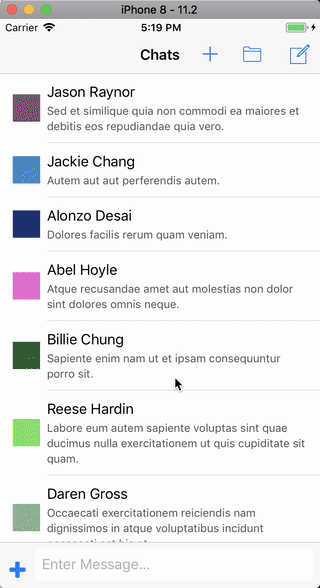

## KSOChatKit

**This project is archived, we recommend you use [MessageKit](https://github.com/MessageKit/MessageKit) instead.**

*KSOChatKit* is an iOS framework that provides various controls for building a Messages like UI. It provides an automatically expanding text view, automatic scroll view management, completion behavior, syntax highlighting, and markdown support.

### Installation

You can install *KSOChatKit* using [cocoapods](https://cocoapods.org/), [Carthage](https://github.com/Carthage/Carthage), or as a framework. 

When installing as a framework, ensure you also link to [Stanley](https://github.com/Kosoku/Stanley), [Loki](https://github.com/Kosoku/Loki), [Quicksilver](https://github.com/Kosoku/Quicksilver), [Agamotto](https://github.com/Kosoku/Agamotto), [Ditko](https://github.com/Kosoku/Ditko), and [KSOFontAwesomeExtensions](https://github.com/Kosoku/KSOFontAwesomeExtensions) as *KSOChatKit* relies on them.

### Dependencies

Third party:

- [Stanley](https://github.com/Kosoku/Stanley)
- [Ditko](https://github.com/Kosoku/Ditko)
- [Loki](https://github.com/Kosoku/Loki)
- [Quicksilver](https://github.com/Kosoku/Quicksilver)
- [Agamotto](https://github.com/Kosoku/Agamotto)
- [KSOFontAwesomeExtensions](https://github.com/Kosoku/KSOFontAwesomeExtensions)